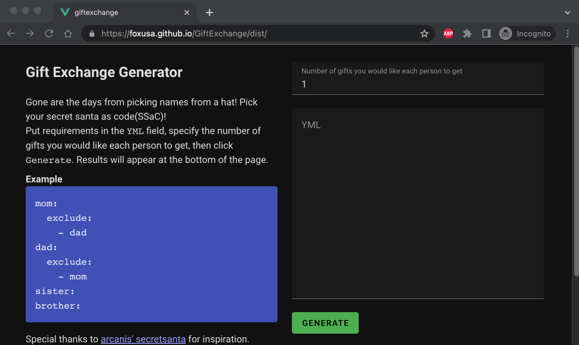

# [Gift Exchange Generator][pages]

[][pages]

A responsive 'Secret Santa' style gift exchange picker/matcher where you don't have to give a random service your emails. You can self host it or just use it [here on GitHub][pages]. Instead of drawing just one name it is configurable. 1,2,3,4+ assignments, no problem.

[Demo/App/Its right here just click it.][pages]

## Matching requirements
- Picks are random
- Cannot pick yourself
- Cannot get the same person twice
- Everyone must have the same number of gifts
- Exclusions must be honored

## License / Credits

> Distributed under the MIT License
> Dependencies distributed under their respective licenses. See package.json for more information
>
> © Jacob Liscom 2022
>
> Special thanks to [arcanis' secretsanta](https://github.com/arcanis/secretsanta) for inspiration.

[pages]: https://foxusa.github.io/GiftExchange/dist/

---

## Build Info

### Project setup
```
npm install
```

#### Compiles and hot-reloads for development
```
npm run serve
```

#### Compiles and minifies for production
```
npm run build
```

#### Run your unit tests
```
npm run test:unit
```

#### Run your end-to-end tests
```
npm run test:e2e
```

#### Lints and fixes files
```
npm run lint
```

#### Customize configuration
See [Configuration Reference](https://cli.vuejs.org/config/).
